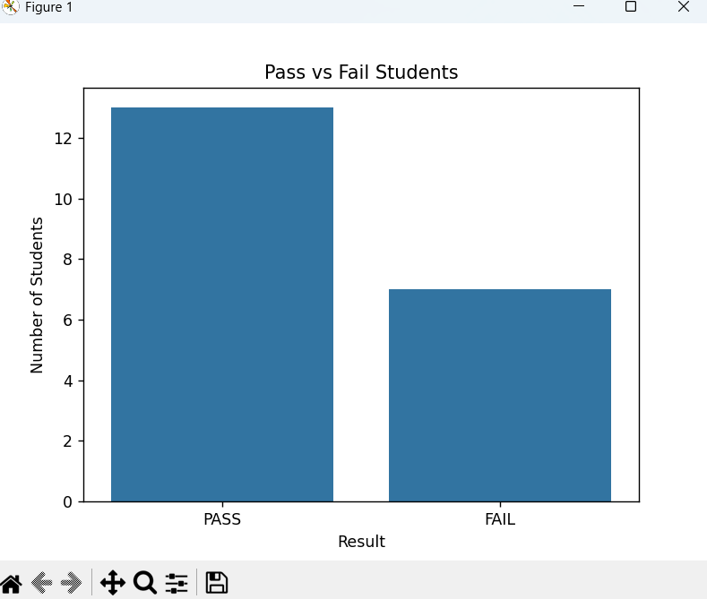
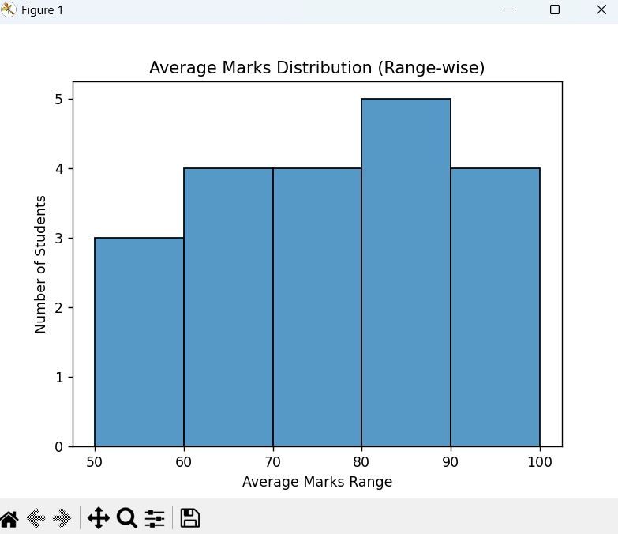
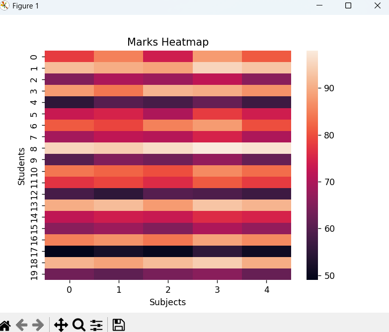

# 📊 Student Marks Analysis Project

A Python-based data analysis and visualization project to analyze student academic performance.

This project calculates:
- Average marks
- Highest & lowest marks
- Pass/Fail status
- Grades
- Subject-wise performance

It also visualizes results using graphs.

---

## 📁 Project Structure

student-marks-analysis/
├── data/
│ └── student_marks_analysis.csv
├── src/
│ └── student_marks_analysis.py
├── outputs/
│ └── graphs/
├── requirements.txt
├── .gitignore
└── README.md


---

## 📸 Project Output (Graphs)

### Pass vs Fail Students


### Grade Distribution


### Subject-wise Pass / Fail


### Average Marks Distribution


### Marks Heatmap


---

## ⚙️ Technologies Used

- Python
- NumPy
- Matplotlib
- Seaborn

---

## ▶️ How to Run the Project

```bash
pip install -r requirements.txt
python src/student_marks_analysis.py
🎓 Learning Outcomes
Data analysis using NumPy

Handling missing values

Data visualization using Matplotlib & Seaborn

Git & GitHub project structure

👩‍💻 Author
Meenakshi Rani